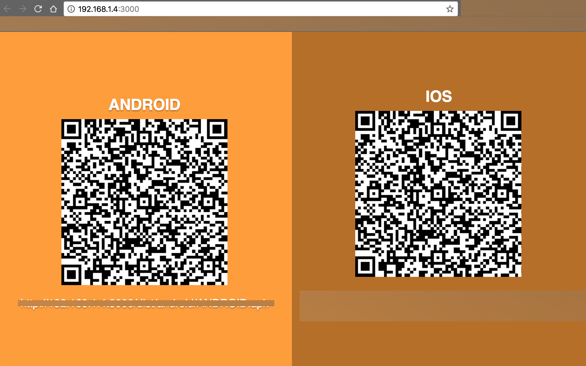

#  bss-rct-build-release

## Requirements
```
- node v7.x+
- npm 4.x+
- react-native-cli: 2.0.1
- react-native: 0.50.4
- OS: MACOS
```

## Usage

- Clone source
- Copy 'Script' to project
- Update gitignore of project
```
  ios-config.json
  Script/**/*.apk
  Script/**/*.ipa
  Script/**/*.plist
```
- Install dependencies
```
  "express": "^4.16.2",
  "open": "0.0.5",
  "request": "^2.83.0"
```
- Add script to project's package.json
```
  "ios-version": "./Script/src/ios-version.sh",
  "ios-release": "./Script/src/ios-release.sh && node ./Script/server/index.js",
  "android-release": "./Script/src/android-release.sh && node ./Script/server/index.js"
```

## Screenshot
Screenshot after build success
